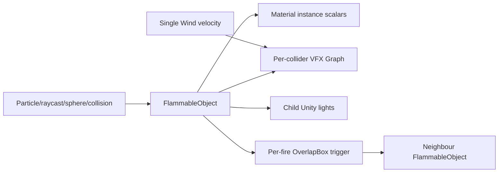
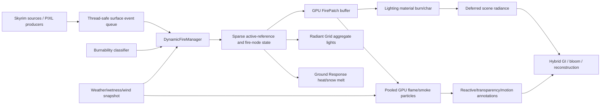
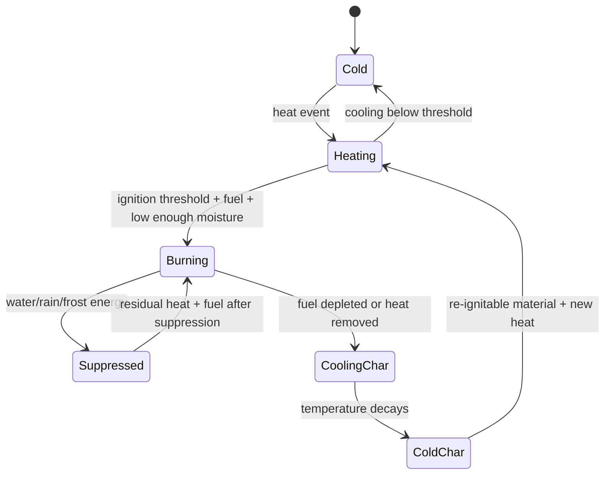
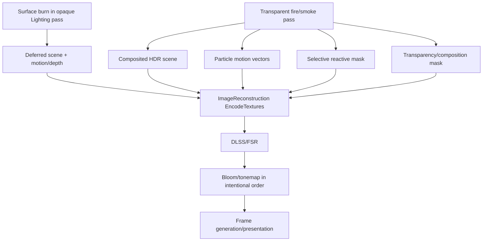

# PIXL Dynamic Fire — Proposed Native Architecture

## Design goals

The proposed module recreates the useful behaviour of the Unity reference while fitting PIXL's actual SKSE/DX11 renderer:

- event-driven ignition and suppression;
- bounded active-world state;
- localized, actor/object-anchored burning;
- progressive heat, flame, char, cooling, and wet suppression;
- pooled flame/smoke/ember/steam rendering;
- renderer-native illumination;
- weather/wind/Ground Response integration;
- stable DLSS/FSR/frame-generation behaviour;
- conservative compatibility with vanilla and modded assets;
- a future path for frost, electrical scorch, blood, acid, soot, and spell residue.

It intentionally excludes universal destruction physics, an unlimited world cellular simulation, and a hard dependency on modified vanilla assets.

## Reference architecture versus PIXL architecture

### Unity reference



### Proposed PIXL



## Recommended system decomposition

Names are proposed and should be adjusted only if implementation conventions require it.

### `DynamicSurfaceEffectsCore`

A small generic foundation, not a giant abstraction:

- stable `SurfaceEffectEvent` structure;
- reference handle plus world position/normal/radius/energy/type/timestamp;
- bounded lock-free or short-lock producer queue;
- effect type registration/packing rules;
- no rendering policy.

Dynamic Fire is the first world-object consumer. ActorSurfaceEffects can later adapt to this producer contract, but it should not be rewritten during the fire prototype.

### `DynamicFire`

A normal `RenderModule` owning settings, GPU resources, GUI, debug modes, and fail-safe lifecycle.

Suggested files:

```text
engine/Modules/DynamicFire.h
engine/Modules/DynamicFire.cpp
engine/DynamicSurfaceEffects/SurfaceEffectEvent.h
engine/DynamicSurfaceEffects/BurnableMaterialClassifier.h/.cpp
pipeline/Dynamic Fire/Kernels/DynamicFire/DynamicFire.hlsli
pipeline/Dynamic Fire/Kernels/DynamicFire/FireSimulationCS.hlsl
pipeline/Dynamic Fire/Kernels/DynamicFire/FireParticleUpdateCS.hlsl
pipeline/Dynamic Fire/Kernels/DynamicFire/FireParticleVS.hlsl
pipeline/Dynamic Fire/Kernels/DynamicFire/FireParticlePS.hlsl
pipeline/Dynamic Fire/Module.ini
```

Do not add all files before each phase needs them.

### `DynamicFireManager`

Game/update-side owner of:

- active reference records;
- ignition/heat/moisture/char lifecycle;
- event consumption;
- material classification cache;
- spatial hash of active fire nodes;
- propagation cadence;
- visibility/importance/LOD decisions;
- sleeping and eviction;
- compact optional persistence later.

It stores handles/IDs and immutable snapshots, never unvalidated raw game pointers across frames.

### `FireRenderState`

Render-side immutable snapshot produced at a synchronization boundary:

- compact `FirePatchGPU` array;
- aggregate light candidates;
- particle emitters;
- current/previous transforms where available;
- generation counter and reset flags.

The render thread does not perform SKSE form lookups, file I/O, classification, or physics queries.

## Event API

Conceptual contract:

```cpp
enum class SurfaceEffectKind : std::uint16_t
{
    Heat,
    Ignition,
    Suppression,
    Char,
    // Reserved future types: Frost, Scorch, Blood, Acid, Residue...
};

struct SurfaceEffectEvent
{
    RE::ObjectRefHandle target;
    SurfaceEffectKind kind;
    RE::NiPoint3 worldPosition;
    RE::NiPoint3 worldNormal;
    RE::NiPoint3 worldVelocity;
    float radius;
    float energy;
    float moisture;
    std::uint32_t sourceFlags;
};
```

The exact ABI should be fixed after the prototype. Required producers include:

- GroundResponse accepted fire/frost projectile and spell contacts;
- fire spells/projectiles/explosions;
- detected Skyrim campfire/torch/brazier sources where appropriate;
- rain/water suppression;
- debug test source.

Repeated events are merged before simulation. Invalid handles, non-finite values, excessive radius/energy, and unsupported references are rejected.

## Active reference and fire-patch state

```text
ActiveFireReference
  ObjectRefHandle
  stable runtime generation
  classification + confidence
  current/previous transform
  bounds and LOD
  moisture / bulk temperature / fuel
  lifecycle timestamps
  N FirePatch nodes
  optional sparse-atlas allocation
```

Each `FirePatch` is object-local when stable transforms are available:

```text
local position and normal
current/previous world position
radius
heat
active flame fraction
char fraction
moisture
fuel
age
seed
```

Multiple patches solve the Unity reference's single-origin limitation. The fixed per-reference node count is quality-tier dependent. Nodes merge when close and similar; the least important node is evicted when full.

## Lifecycle model

This remains intentionally compact rather than pretending to solve combustion chemistry.



State variables evolve using elapsed seconds, never assumed frame count. Proposed simplified equations:

```text
moisture += rain/water absorption - evaporation(temperature, exposure)
heat += submittedEnergy + neighbourRadiance - cooling(dt, moisture, weather)
ignitionDrive = heat * fuel * (1 - moistureResistance)
burnRate = ignitionDrive * materialSpreadRate
fuel -= burnRate * dt
char += burnRate * charYield * dt
smokeRate = burnRate * smokeYield
```

All terms are clamped to finite physical/artistic ranges. No division occurs without a denominator floor.

## Propagation

Propagation runs at a reduced fixed cadence over active fire nodes, not per rendered object every frame.

1. Update spatial hash buckets for active nodes.
2. Query only neighbouring buckets within the current node's heat radius.
3. Consider only references already classified or newly touched by a fire event.
4. Compute a bounded transfer term from distance, line-of-sight confidence, material fuel, moisture, wind alignment, and source heat.
5. Queue heat/ignition events for the next simulation step.
6. Cap transferred energy and receiver count per source.

Wind bias should accelerate downwind transfer and reduce upwind transfer without making fire teleport. Full Havok ray tests are reserved for a small number of high-priority transfers; lower tiers use bounds/visibility confidence.

## Surface rendering

### MVP analytical path

For each eligible Lighting draw, bind a small draw-specific payload containing a reference identity, local transform, and nearby fire patches. HLSL evaluates a soft union of ellipsoidal/geodesic-approximation lobes.

Material progression:

```text
original
  -> drying/heating: slightly darker, lower moisture
  -> pyrolysis front: darkened albedo + narrow controlled emission
  -> active burning: flame anchor + emissive cracks
  -> char: dark diffuse, high roughness, reduced metallic contamination
  -> cooling char/ash: emission decays, soot/char remains
```

The material is modified, not replaced. Existing albedo, normal, PBR, skin, fur, wetness, and snow logic remain upstream inputs. Metal and stone reject the burn material response unless explicitly overridden.

Robust burn-front shape:

- smooth, derivative-aware boundary;
- low-frequency object-local breakup;
- no hard `distance < radius` step;
- mip/derivative-limited detail;
- safe `normalize`, `pow`, reciprocal, and HDR emission limits;
- current and previous object transforms retained for motion where required.

### Production near-field path

After the prototype proves object identity, high-priority objects may receive a sparse local atlas slot:

- 64² or 128² `R8G8B8A8_UNORM`/appropriate packed format;
- channels such as heat, active burn, char, moisture;
- compute-updated only while dirty;
- pooled slots with generation IDs to prevent stale reuse;
- analytical nodes remain the authoritative fallback and propagation state;
- no full-resolution texture per object.

Atlas use must require adequate non-overlapping UVs or a generated/object-space projection. Bad UVs fall back to analytical nodes.

## Particle architecture

### Simulation

One pooled structured buffer stores flame, smoke, ember, and steam particles. A compute pass:

- consumes prioritized emitter patches;
- spawns into a fixed pool/free list;
- updates age, position, velocity, size, rotation, temperature, opacity, and type;
- evaluates deterministic PIXL wind and turbulence;
- writes compact alive lists/indirect draw arguments where supported;
- sleeps when no emitters exist.

### Rendering

Use instanced billboards/flipbooks with:

- soft depth intersection;
- scene-linear HDR fire colour from temperature/blackbody-inspired ramp;
- non-emissive, light-responsive smoke;
- alpha-premultiplied composition;
- distance LOD and size filtering;
- no high-frequency analytic noise beyond what mip/filtering can stabilize;
- separate flame/ember and smoke draw groups if blend state requires it.

Near flame geometry needs current/previous particle positions for motion vectors. Smoke and emissive flames must write/select reconstruction annotations rather than relying on alpha alone.

### LOD

| Distance/importance | Representation |
| --- | --- |
| Near | Full particles, local burn state, light/GI, selective motion/reactive masks |
| Medium | Fewer particles, analytical surface state, aggregate light |
| Far | One/few emissive impostors and smoke cards; no propagation detail |
| Culled/sleeping | Scalar lifecycle at low frequency; no GPU particle work |

## Lighting integration

Dynamic Fire should expose aggregate `FireLightCandidate` records to Radiant Grid before `UpdateLights()` uploads the clustered light list.

Clustering rules:

- merge fire patches that overlap spatially and share a room/outdoor context;
- energy-weight colour and position;
- deterministic low-frequency flicker based on aggregate burn energy;
- one light per coherent fire group, not per particle or patch;
- respect MAX_LIGHTS and existing scene light priority;
- use natural attenuation and room/portal flags when resolvable;
- shadow casting is optional/high-tier and should never allocate a Skyrim shadow light per patch.

The emissive surface and flame particle radiance should enter the scene-linear radiance input before Hybrid GI captures it. Direct Radiant Grid light supplies immediate local response; Hybrid GI/world cache supplies restrained indirect bounce. The two contributions must be calibrated to avoid double counting.

## Weather, wetness, wind, and ground integration

### Weather/wetness

- Read a game/update-side immutable weather snapshot.
- Live rain adds suppression/moisture only to exposed exterior references.
- Existing RainResponse wetness can raise ignition resistance.
- Clear weather does not imply dryness instantly; evaporation is time/temperature driven.
- Seasons context must not be treated as weather.

### Wind

Extract a shared `WindContext` instead of including foliage-specific material logic:

```text
base direction/speed
gust field parameters
current time
previous time
valid exterior/interior flag
```

The HLSL field can reuse PIXL's broad deterministic world-space gust principles. Current and previous evaluation must be available for particle motion vectors.

### Ground Response

- Strong fire nodes submit bounded heat/melt stamps to snow through the existing elemental event path.
- Avoid duplicating a spell impact already submitted by GroundResponse.
- Wet mud/water suppresses low fires; it is not globally made nonflammable by season.
- Fire does not write terrain burn masks in the first release unless terrain classification and projection are explicitly supported.

## Skyrim ignition-source interoperability

Priority sources:

1. projectile/magic impact data already captured by GroundResponse;
2. fire explosions and continuous concentration spells near accepted references;
3. detected particle/effect emitters classified as flame/torch/brazier/campfire (Radiant Grid already has useful name/config evidence);
4. actor burning effects;
5. explicit PIXL API/Papyrus calls for mod authors.

Do not scan every loaded form each frame. Cache classifications at observation time, queue impact events, and poll only active continuous sources at a bounded interval.

Static decorative fire should not automatically ignite its containing brazier or stone hearth. Source detection and receiver classification are separate decisions.

## Reconstruction and frame-generation flow



Requirements:

- surface char/burn is actor/object anchored and uses geometry motion;
- near particles provide motion in PIXL's expected convention;
- emissive flame change writes a moderate reactive value;
- translucent smoke writes transparency/composition confidence;
- masks are selective, not full-screen;
- particle spawn/death and camera cuts reject stale history;
- emission is scene-linear and firefly-clamped before bloom extraction;
- RCAS observes the unstable-surface masks already used to reduce sharpening;
- UI/HUD remains outside fire annotations;
- frame generation suspends/resets normally during load/menu/photo transitions through existing reconstruction state.

The current reconstruction mask is built from Skyrim's temporal AA mask and the deferred normal/water-mask target. A custom fire pass therefore needs an explicit merge path before `ImageReconstruction::EncodeTextures`; merely drawing alpha does not prove correct mask coverage.

## Resource and binding strategy

No final register numbers should be chosen in the architecture document. They require a full live binding audit when implementation begins.

Expected bounded resources:

- one dynamic/immutable `FirePatchGPU` SRV;
- one active-reference/draw lookup buffer if prototype identity permits;
- one pooled particle SRV/UAV;
- one emitter buffer;
- one alive list/free list and optional indirect args buffer;
- optional sparse burn atlas plus generation/indirection table in later phase;
- one small settings constant buffer;
- optional fire-only reactive/transparency/motion render targets or direct compatible target writes.

Every CPU/HLSL structure must use append-only/aligned layouts with `static_assert` size/offset checks. SRVs/UAVs must be unbound after compute/render passes. Resource failure disables Dynamic Fire only and logs one actionable error.

## Threading and lifetime

```text
Game/update thread:
  validate handles -> classify -> consume events -> simulate scalar/node state
                         |
                         v
                 immutable generation snapshot
                         |
Render thread:
  upload changed snapshot -> dispatch particles/masks -> draw -> publish light candidates
```

- No locks in per-pixel/draw hot paths beyond a short snapshot swap.
- No game form lookup on the render thread.
- Destruction/unload invalidates the reference generation and atlas allocation.
- Buffers use generation IDs so reused slots cannot display another object's char.
- Module reset/cell transition clears or sleeps unsafe transient state.

## Material classification architecture

`BurnableMaterialClassifier` returns a reasoned result:

```text
class: Nonflammable / Wood / Cloth / Paper / Vegetation / Organic / Oil / Unknown
confidence
fuel, ignition, spread, char, smoke, moisture parameters
evidence bits
```

Evidence precedence:

1. explicit deny;
2. explicit allow/profile;
3. mod-authored metadata;
4. reference/base-form archetype;
5. physical material and shader traits;
6. boundary-aware mesh/texture path tokens;
7. fail-closed unknown.

The cache key must include relevant material/reference generation, not just texture name. Debug UI shows the classification, confidence, and evidence. Users should not need to tune the classifier in the normal panel; advanced JSON overrides are sufficient.

## Settings and quality tiers

Normal user panel:

```text
Dynamic Fire                         Enable
Quality                              Low / Medium / High / Ultra
Simulation Distance                  1,500–12,000 units
Maximum Active Fires                 quality-constrained
Fire Spread                          0–100%
Wind Response                        0–200%
Weather Response                     0–200%
Flame Quality                        Low / Medium / High / Ultra
Smoke Quality                        Off / Low / Medium / High
Lighting Contribution                0–150%
Charred Surface Detail               Off / Standard / High
```

Proposed defaults should preserve Skyrim behaviour until explicitly enabled during development. For public release, enable only after live validation.

| Tier | Active refs | Patches/ref | Particle pool | Propagation | Atlas |
| --- | ---: | ---: | ---: | --- | --- |
| Low | 16 | 2 | ~4k | 5 Hz, near only | Off |
| Medium | 32 | 4 | ~12k | 7.5 Hz | Off/selected |
| High | 64 | 6 | ~24k | 10 Hz | 64² priority pool |
| Ultra | 96 | 8 | ~48k | 15 Hz | 64²/128² priority pool |

These are initial engineering budgets, not promised final numbers. They must be measured in Skyrim and adjusted without changing the module contract.

Developer diagnostics:

- reference identity and generation;
- burnability class/confidence/evidence;
- heat/fuel/moisture/char channels;
- active fire nodes and propagation radius;
- particle emitters/alive count/LOD;
- aggregate lights and GI contribution;
- reactive/transparency/motion masks;
- atlas ownership/generation;
- dropped events, evictions, and simulation time.

## Persistence policy

MVP: state persists while the reference remains active/loaded and may reset on unload. No save-game data.

Later optional persistence serializes only compact logical state:

```text
form/reference identity
quantized local patch positions/radii
heat/fuel/moisture/char
age/version
```

Never serialize GPU textures. On load, validate plugin/form identity and rebuild GPU masks from logical patches. Temporary/generated references are skipped unless a reliable identity exists.

## Failure and compatibility policy

- Missing assets: disable particles or use a minimal procedural fallback; retain surface state if safe.
- Shader/compute compile failure: disable only the affected tier/path.
- Unknown material: nonflammable.
- Unsupported geometry/transform: scalar/distant effect or skip; never bind another reference's state.
- Pool exhausted: drop lowest-priority distant state with metrics; player/near quest scenes retain priority.
- Reconstruction integration unavailable: surface burn can run, but transparent Dynamic Fire remains disabled rather than shipping ghosting.
- Dynamic Fire disabled: zero material changes, no simulation/particle/light work, and all existing PIXL modules behave identically.

## Scope proposals

### Minimum viable system

- One explicit/debug ignition source.
- Stable identity test on selected static objects and actors.
- Conservative wood-only allowlist.
- Up to four analytical object-local patches.
- Heat -> glow -> char -> cool lifecycle.
- No propagation, smoke, persistence, or weather.
- One aggregate Radiant Grid light.
- Reconstruction-mask debug view.

This proves the two architectural risks without destabilizing the renderer.

### Recommended PIXL implementation

- Magic/projectile/campfire ignition events.
- Conservative material classifier with overrides.
- Bounded multi-patch active-reference manager.
- Analytical surface burn plus selected sparse atlas near-field detail.
- Pooled flames, embers, smoke, and steam.
- Aggregate Radiant Grid light and restrained Hybrid GI response.
- Wind, rain/wetness, water suppression, and snow melt integration.
- Full quality tiers, diagnostics, temporal masks, and safe fallbacks.
- Runtime persistence while loaded; no save serialization initially.

### Long-term advanced system

- Compact save persistence.
- Authored high-confidence UV masks for selected important assets.
- Vegetation propagation and terrain scorch in supported material classes.
- Fire/smoke volumetric coupling and local fog extinction.
- Limited shadowed aggregate fire lights.
- Shared Dynamic Surface Effects consumers: frost, lightning scorch, blood, acid/corrosion, soot, ash, and persistent spell impacts.
- Mod-author API for material profiles and scripted ignition/suppression.

## Final recommendation

**PROTOTYPE FIRST — architecture viable but major unknowns remain**

Proceed with the isolated identity/mapping and temporal-mask prototype described in the implementation plan. If both gates pass, the recommended hybrid architecture is a strong fit for PIXL and should produce substantially better fidelity and scalability than the Unity reference.
